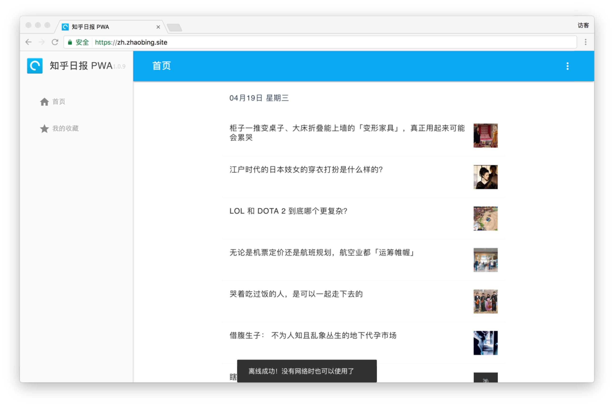
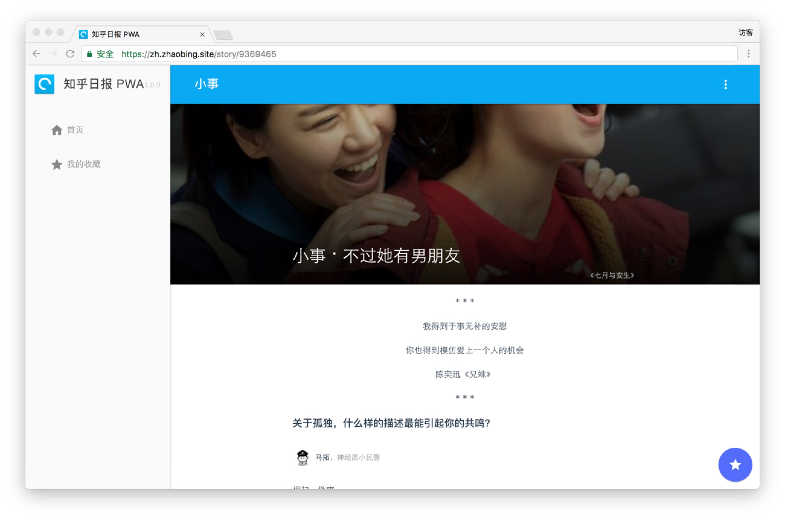

# zhihu-daily-pwa

[](https://travis-ci.org/binggg/zhihu-daily-pwa)

> 非官方 知乎日报 PWA (Progressive Web App) 版本，基于 Vue.js 2.0





## 访问地址

[知乎日报 PWA](https://zh.zhaobing.site)

## 构建命令

``` bash
# install dependencies
npm install

# serve with hot reload at localhost:8080
npm run dev

# build for production with minification
npm run build
```

For detailed explanation on how things work, checkout the [guide](http://vuejs-templates.github.io/webpack/) and [docs for vue-loader](http://vuejs.github.io/vue-loader).
